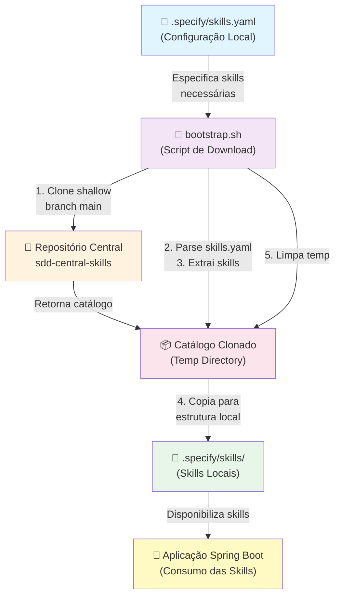
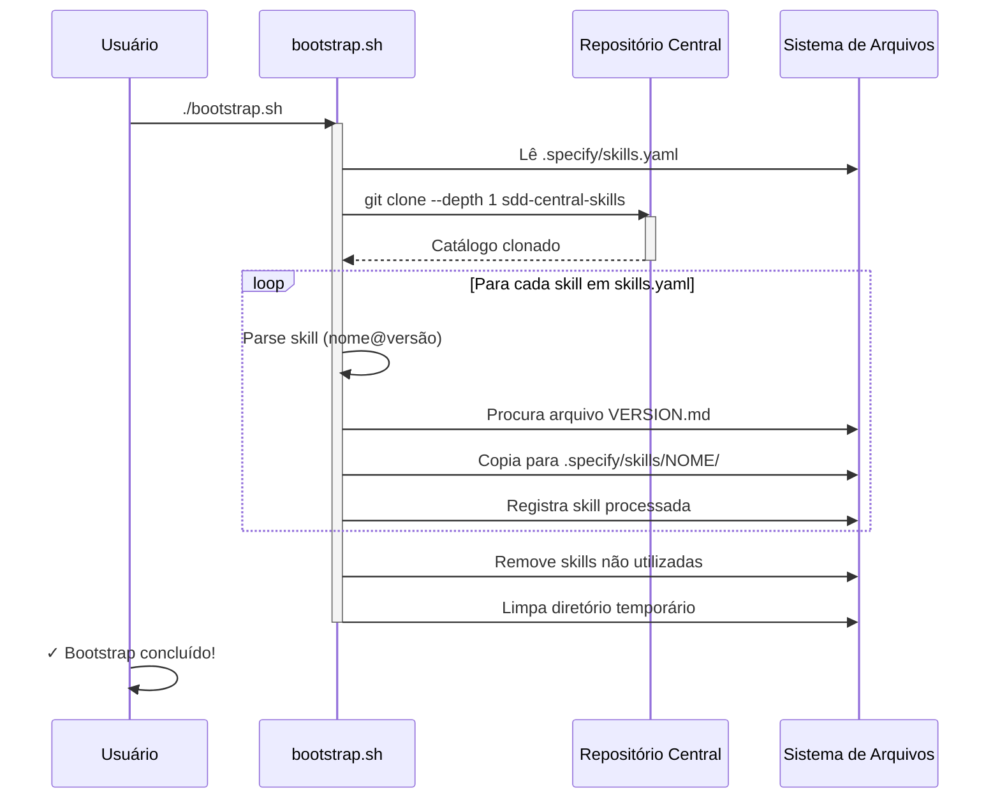
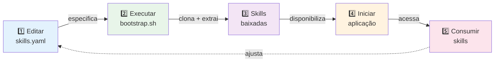
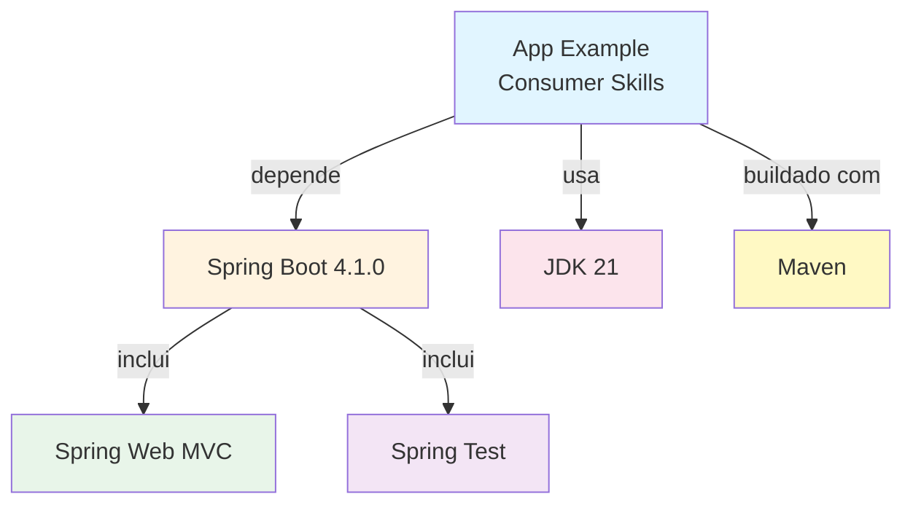

# SDD App Example Consumer Skills

## 📋 Visão Geral

Este é um **Proof of Concept (POC)** que demonstra como consumir dinamicamente **Skills** a partir de um catálogo centralizado. A aplicação utiliza um arquivo de configuração YAML para especificar quais skills deseja utilizar e, através de um script de bootstrap, baixa essas skills do repositório central.

### Objetivo

Estabelecer um padrão de consumo dinâmico de skills que permite:
- ✅ Centralizar definições de skills em um repositório único
- ✅ Versionamento independente de cada skill
- ✅ Consumo seletivo apenas das skills necessárias
- ✅ Estrutura escalável e manutenível

---

## 🏗️ Estrutura do Projeto

```
sdd-app-example-consumer-skills/
├── .specify/                           # Diretório com configurações de skills
│   ├── skills.yaml                     # Definição das skills a consumir
│   └── skills/                         # Skills baixadas (gerado após bootstrap)
│       ├── architecture-hexagonal/
│       │   └── skill.md
│       └── java-21/
│           └── skill.md
│
├── src/
│   ├── main/
│   │   ├── java/
│   │   │   └── com/github/fnsousa/app_example_consumer_skills/
│   │   │       └── AppExampleConsumerSkillsApplication.java
│   │   └── resources/
│   │       ├── application.properties
│   │       ├── static/                # Recursos estáticos
│   │       └── templates/             # Templates
│   └── test/
│       └── java/
│           └── com/github/fnsousa/app_example_consumer_skills/
│               └── AppExampleConsumerSkillsApplicationTests.java
│
├── bootstrap.sh                        # Script para baixar as skills
├── pom.xml                            # Configuração Maven
├── README.md                          # Este arquivo
└── HELP.md                            # Ajuda adicional do Spring Boot
```

---

## 🔄 Fluxo de Consumo de Skills

### Diagrama de Arquitetura



---

## 🚀 Como Executar

### Pré-requisitos

- **Java 21+** instalado
- **Git** configurado com acesso SSH (para clonar repositórios privados)
- **Maven 3.6+** (opcional, o projeto inclui `mvnw`)
- Chave SSH configurada para acesso ao repositório central

### Passo 1: Configurar as Skills Desejadas

Edite o arquivo `.specify/skills.yaml` para especificar quais skills você deseja:

```yaml
catalog:
  repository: git@github.com:fnsousa/sdd-central-skills.git
  branch: main

skills:
  - architecture/hexagonal@1.0.0
  - java-21@2.0.0
  # Adicione mais skills conforme necessário
```

**Formato da skill:**
```
<categoria>/<nome>@<versão>
```

### Passo 2: Executar o Bootstrap

Execute o script `bootstrap.sh` para baixar as skills especificadas:

```bash
./bootstrap.sh
```

**O que o script faz:**



### Passo 3: Executar a Aplicação

Inicie a aplicação Spring Boot:

```bash
# Usando Maven wrapper (recomendado)
./mvnw spring-boot:run

# Ou com Maven instalado
mvn spring-boot:run
```

A aplicação iniciará em `http://localhost:8080`

---

## 📁 Estrutura Resultante Após Bootstrap

Após executar o bootstrap com sucesso, a estrutura será:

```
.specify/
├── skills.yaml                          # Configuração original
└── skills/                              # Skills baixadas
    ├── architecture-hexagonal/
    │   └── skill.md                     # Documentação da skill
    └── java-21/
        └── skill.md                     # Documentação da skill
```

### Conteúdo de uma Skill

Cada skill é um arquivo Markdown (`.md`) contendo:

```markdown
# Nome da Skill

## Descrição
Detalhes e propósito da skill...

## Uso
Como utilizar esta skill...

## Exemplos
Exemplos práticos...

## Referências
Links relacionados...
```

---

## ⚙️ Fluxo Completo Passo a Passo



---

## 🔍 Detalhes do Bootstrap Script

### Variáveis Principais

| Variável | Descrição |
|----------|-----------|
| `CATALOG_REPO` | URL do repositório central de skills |
| `BRANCH` | Branch do repositório a utilizar (padrão: main) |
| `SPECIFY_DIR` | Diretório raiz de configuração (.specify) |
| `SKILLS_FILE` | Arquivo de configuração (skills.yaml) |

### Lógica do Script

1. **Validação**: Verifica se `skills.yaml` existe
2. **Clone**: Clona o repositório central com `--depth 1` (otimizado)
3. **Parse**: Lê o arquivo `skills.yaml` e extrai lista de skills
4. **Download**: Para cada skill:
   - Procura o arquivo `{NOME}/{VERSÃO}.md` no catálogo
   - Copia para `.specify/skills/{NOME}/skill.md`
   - Registra skill processada
5. **Limpeza**: Remove skills que estavam presentes mas não estão mais em `skills.yaml`
6. **Finalização**: Limpa diretórios temporários

### Tratamento de Erros

O script trata automaticamente:
- ✅ Skills não encontradas no catálogo
- ✅ Arquivo `skills.yaml` ausente
- ✅ Falhas de clone do repositório
- ✅ Limpeza de diretórios temporários (mesmo em caso de erro)

---

## 🛠️ Configuração da Aplicação

### Application Properties

```properties
spring.application.name=app-example-consumer-skills
```

Edite `src/main/resources/application.properties` para adicionar configurações conforme necessário.

---

## 📊 Tecnologias Utilizadas

| Tecnologia | Versão | Propósito |
|-----------|--------|----------|
| Java | 21 | Linguagem principal |
| Spring Boot | 4.1.0 | Framework web |
| Maven | 4.0.0 | Gerenciador de dependências |
| Bash | - | Script de automação |

---

## 🚨 Resolução de Problemas

### Erro: "Arquivo .specify/skills.yaml não encontrado"

**Solução:** Execute o script do diretório raiz do projeto:
```bash
cd /caminho/para/sdd-app-example-consumer-skills
./bootstrap.sh
```

### Erro: "Skill não encontrada no catálogo"

**Solução:** Verifique:
1. O nome e versão estão corretos em `skills.yaml`
2. A skill existe no repositório central
3. Você tem acesso SSH ao repositório

### Erro: "Permission denied: ./bootstrap.sh"

**Solução:** Conceda permissão de execução:
```bash
chmod +x bootstrap.sh
./bootstrap.sh
```

### Erro ao conectar via SSH

**Solução:** Configure sua chave SSH:
```bash
ssh-keygen -t ed25519 -C "seu.email@example.com"
ssh-add ~/.ssh/id_ed25519
# Adicione a chave pública ao GitHub (Settings > SSH Keys)
```

---

## 📚 Estrutura de Dependências



---

## 🔗 Repositórios Relacionados

- **Catálogo Central de Skills**: [sdd-central-skills](https://github.com/fnsousa/sdd-central-skills)
- **Skills Disponíveis**: Veja o repositório central para lista completa

---

## 👤 Autor

Felipe Nascimento ([fnsousa](https://github.com/fnsousa))

---

## 📝 Notas Adicionais

### Versionamento de Skills

Cada skill segue o padrão semântico:
- **MAJOR**: Mudanças incompatíveis
- **MINOR**: Novas funcionalidades compatíveis
- **PATCH**: Correções de bugs

Especifique sempre a versão desejada em `skills.yaml` para garantir comportamento consistente.

### Boas Práticas

1. ✅ Sempre especifique versões exatas em `skills.yaml`
2. ✅ Execute o bootstrap sempre que atualizar `skills.yaml`
3. ✅ Mantenha `.specify/skills/` no `.gitignore` (conteúdo gerado)
4. ✅ Versione apenas `skills.yaml` no repositório

### Próximas Etapas

- [ ] Implementar integração das skills com endpoints HTTP
- [ ] Criar mecanismo de recarregamento dinâmico de skills
- [ ] Adicionar API de management de skills
- [ ] Implementar cache de skills baixadas

---

**Última atualização:** 2026-06-16
